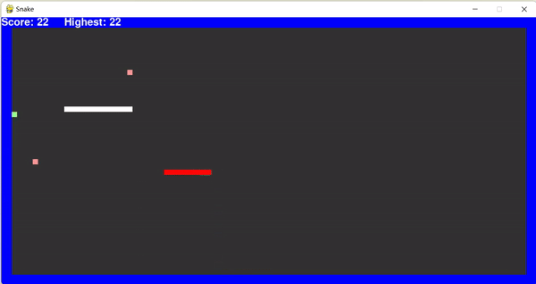
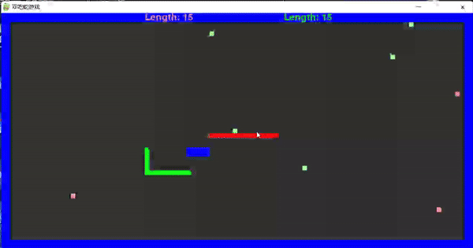

# Snake

A Simple two-player Snake game

## 游戏规则

**简介**：两条小蛇各取所需，亦或互相对抗，通过进食获取高分。

### 生存模式

生存模式的核心在于**存活下来**并且**力争高分**，目前已有**Pair**与**Solo**两种子模式。

#### Pair

- 玩家将**同时**控制小红和小绿两条小蛇
- 通过**WSAD**控制小红的上下左右
- 通过**方向键**控制小绿的上下左右
- 两条蛇相互配合争取高分

#### Solo

- 玩家通过**WSAD**控制小红的上下左右
- 小白为**电脑蛇**，将会与你抢夺食物和生存空间
- 小红**吃下自己食物**和**击杀小白**都可以获得分数
- 小白死亡后将于随机地点**复活**

  

### 双人模式

- 玩家1：通过**WSAD**控制小红的上下左右，按空格键发动技能“断尾”
- 玩家2：通过**方向键**控制小绿的上下左右，按右“ctrl”键发动技能“断尾”
- 小蛇在吃下食物后将大幅增长，对方死亡则自己获得胜利。
- 断尾： 小蛇舍弃自己的后半段身体，该部分留在原地成为永久地形，双方均不可触碰。**在蛇体长度>=20时可发动技能**

  

- 期间将出现紫色中立资源，双方均可争夺。中立资源具有较大的加成

### 导致小蛇死亡的情形

- 撞到蓝色永久地形
- 自己撞自己
- 撞上另外一条蛇
- 吃错食物

## 可能出现的问题

经测试，在刚进入游戏的时候可能会出现按键后小蛇行动不发生改变的情况。此时需**按shift键将输入法改为英文模式**。

## 后记

以上就是**Snake**的主要游戏机制。

感谢您对**Snake**的支持，也希望**Snake**可以有新的模式与各位再次见面。祝您游戏愉快！！！
